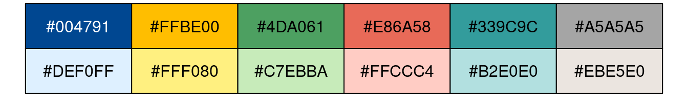
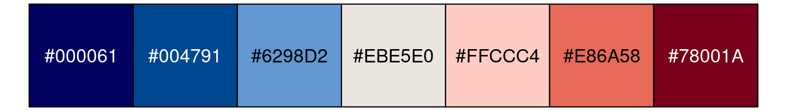
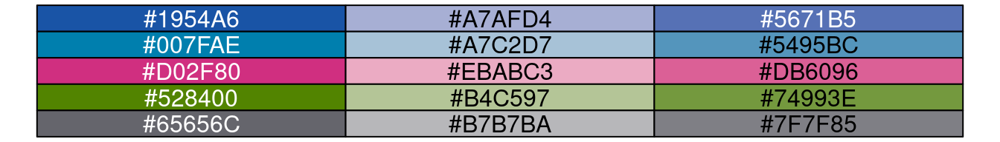
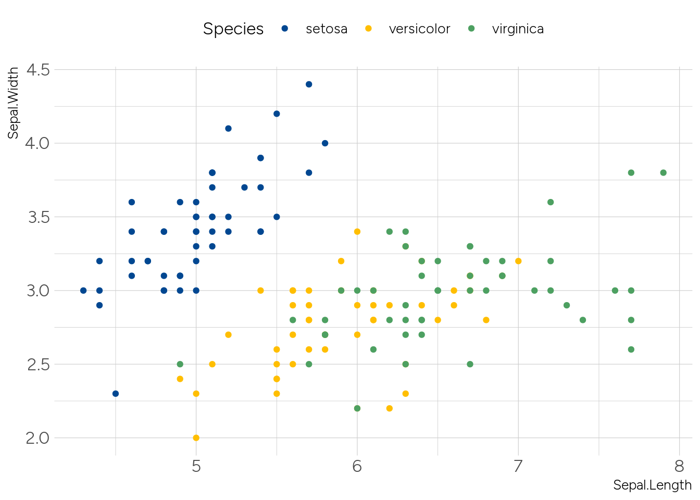
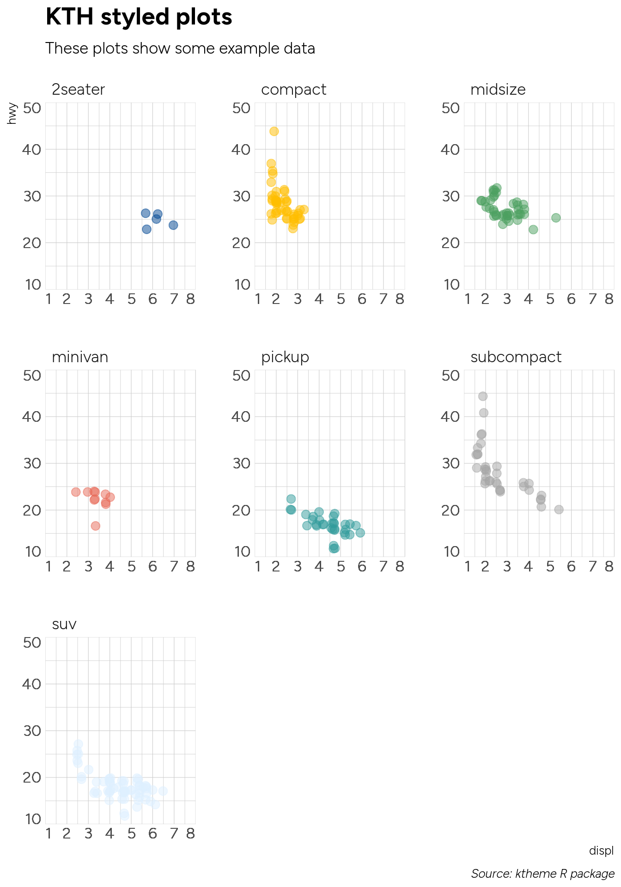
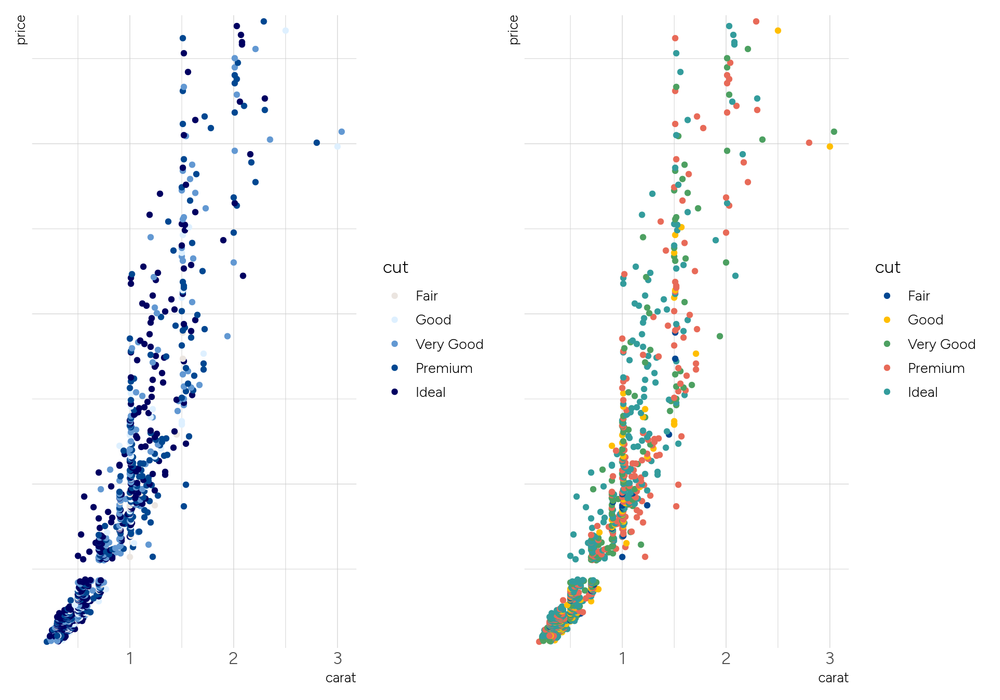
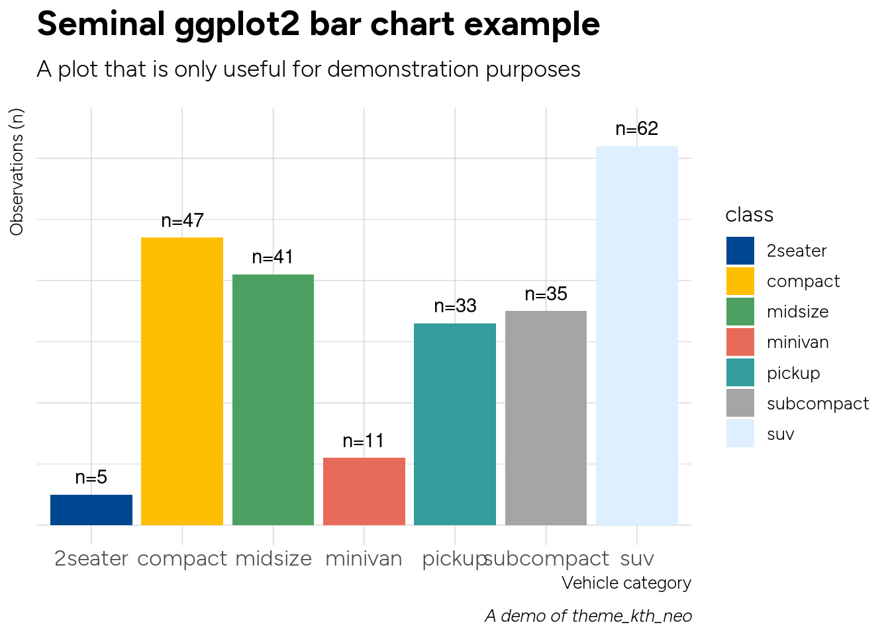

<!-- README.md is generated from README.Rmd. Please edit that file -->

# ktheme

<!-- badges: start -->

[](https://www.tidyverse.org/lifecycle/#experimental)
[](https://github.com/KTH-Library/ktheme/actions)
[](https://github.com/KTH-Library/ktheme/actions/workflows/R-CMD-check.yaml)
<!-- badges: end -->

This is an R package providing some styling resources for web content
intended to align with the graphical profile used at KTH Royal Institute
of Technology.

It is heavily inspired by <https://github.com/hrbrmstr/hrbrthemes>. Most
of the graphical design considerations, the package structure used and
the functions are either ripped directly or modified slightly from that
package adapting it to [KTH’s graphical
profile](https://intra.kth.se/en/administration/kommunikation/grafiskprofil)

The styling assets and resources are different, though (fonts,
templates, color palettes etc).

## Content

This package installs various styling assets as outlined below.

### Fonts

It includes fonts in the two main font families used in the graphical
profile of KTH:

- Open Sans (primary font; to be used for web content and for text
  inside plots)
- Georgia (KTH has a license to use this MS font)
- Open Sans Condensed is a narrow variant of Open Sans (looks even
  better in plots)
- Figtree (SIL-licensed font)

### Templates for rmarkdown content

Two templates are provided for styling `rmarkdown` authored content:

- one for general HTML content with the KTH CSS styles
- one for PDF output

### Theme for ggplot2

It also provides a `theme_kth()` function which can be used to style
ggplots.

## Installation

You can install the development version of `ktheme` from
[GitHub](https://github.com/) with:

``` r
# install.packages("devtools")
devtools::install_github("KTH-Library/ktheme")
```

## Usage

A helper function is availble for system-wide install of fonts on Linux
OSes:

``` r
# install from https://github.com/KTH-Library/bibliomatrix
library(ktheme)
if(Sys.info()["sysname"] == "Linux")
  install_fonts_linux()

#library(extrafont)
#extrafont::loadfonts()

# required in the following usage examples 
library(dplyr)
library(ggplot2)
library(Cairo)
```

# Color palettes

Two color palettes are provided; the “standard” and the “digital”
palette.

Both palettes take their starting point in a set of colors originating
from the [KTH signature
colors](https://intra.kth.se/en/administration/kommunikation/grafiskprofil/profilfarger-1.845077).

These color palette can be used to color qualitative data, sequential
data and diverging data.

- qualitative palette for nominal or unordered categorical values (using
  the primary KTH profile color (blue), followed by the four secondary
  profile colors, each color available in triplets (darker tone, lighter
  tone, medium tone), thus providing a total of 5 x 3 = 15 colors)
- sequential palette for quantitative magnitudes - high/low values - or
  for ordered categorical data (the primary color in 5 stepped
  variations - from the strongest tone stepping towards a neutral gray)
- diverging palette for use with quantitative values centered around
  some point - or centered ordered categorical data of that same nature
  (the primary color is used on one end of the palette and the closest
  complement color on the other to provide a 7-color palette with three
  steps of blue towards a gray midpoint and three steps of red away from
  that midpoint)

## Standard KTH palette

This palette is based on the [standard KTH
colors](https://intra.kth.se/en/administration/kommunikation/grafiskprofil/profilfarger-1.845077).

``` r

# for nominal categorical coloring, try to use five colors
palette_kth_neo(n = 6) %>% unname %>% show_pal()
```

<!-- -->

``` r

# if you need to color more categorical data, use color pairs
palette_kth_neo(n = 12) %>% unname %>% show_pal(nrow = 2, ncol = 6)
```

<!-- -->

``` r

# for categorial colors there is a maximum of 15 color triplets
# use with caution as the medium and strong triplet members might be hard to distinguish
palette_kth_neo(n = 18) %>% unname %>% show_pal(ncol = 6, nrow = 3)
```

<!-- -->

``` r

# sequential categorical offers a maximum of 7 steps (primary color, fading towards gray)
palette_kth_neo(n = 5, type = "seq") %>% unname %>% show_pal()
```

<!-- -->

``` r
palette_kth_neo(n = 5, type = "seq") %>% unname %>% show_pal(borders = FALSE, labels = FALSE)
```

<!-- -->

``` r

# diverging categorical offers a maximum of 7 steps (primary color and complementary color, steps towards gray in the middle)
palette_kth_neo(n = 7, type = "div") %>% unname %>% show_pal()
```

<!-- -->

``` r
palette_kth_neo(n = 7, type = "div") %>% unname %>% show_pal(labels = FALSE, borders = FALSE)
```

<!-- -->

## Palette “KTH Digital”

This palette is based on the previous set of [KTH colors for Digital
media](https://intra.kth.se/administration/kommunikation/grafiskprofil/profilfarger-1.845077)

``` r

# all 5 colors (primary and secondary signature colors) in triplets (faded towards gray, "strong", "light" and "medium")
palette_kth_digital(n = 15) %>% unname %>% show_pal(ncol = 5, nrow = 3)
```

<!-- -->

``` r

# sequential 5 steps (primary color, fading towards gray)
palette_kth_digital(n = 5, type = "seq") %>% unname %>% show_pal()
```

<!-- -->

``` r

# diverging 7 steps (primary color and complementary color, steps towards gray in the middle)
palette_kth_digital(n = 7, type = "div") %>% unname %>% show_pal(labels = FALSE, borders = FALSE)
```

<!-- -->

# Usage

Here are usage examples showing plots made using the different KTH color
palettes and the Open Sans font.

A plain vanilla scatter plot:

``` r
ggplot(mtcars, aes(mpg, wt)) +
  geom_point() +
  labs(x="Fuel efficiency (mpg)", y="Weight (tons)",
    title="KTH styled ggplot2 scatterplot example",
    subtitle="A plot that is only useful for demonstration purposes",
    caption="Caption goes here!") + 
  theme_kth_figtree()
```

<!-- -->

Using the KTH palette, qualitative coloring:

``` r

ggplot(iris, aes(Species, Sepal.Length)) + 
  geom_boxplot(aes(fill = Species)) +
  scale_fill_kth() +
  theme_kth_figtree() +
  theme(legend.position = "top")
```

<!-- -->

``` r

ggplot(iris, aes(Sepal.Length, Sepal.Width)) + 
  geom_point(aes(color = Species)) +
  scale_color_kth() +
  theme_kth_figtree()+
  theme(legend.position = "top")
```

<!-- -->

Another example using demo data:

``` r
ggplot(mpg, aes(displ, hwy)) +
  geom_jitter(aes(color=class, fill=class), size=3, shape=21, alpha=1/2) +
  scale_x_continuous(expand=c(0,0), limits=c(1, 8), breaks=1:8) +
  scale_y_continuous(expand=c(0,0), limits=c(10, 50)) +
  scale_color_kth() +
  scale_fill_kth() +
  facet_wrap(~class, scales="free") +
  labs(
    title="KTH styled plots",
    subtitle="These plots show some example data",
    caption="Source: ktheme R package"
  ) +
  theme_kth_figtree() +
  theme(legend.position="none")
```

<!-- -->

``` r

#flush_ticks(gg)
```

Diverging colors:

``` r
cars <- 
  mtcars %>%
  mutate(brand = rownames(mtcars)) %>%
  mutate(mpg_z_score = (mpg - mean(mpg, na.rm = TRUE)) / sd(mpg)) %>%
  mutate(mpg_type = ifelse(mpg_z_score < 0, "below", "above")) %>%
  mutate(CarBrand = factor(mpg_type, levels = unique(mpg_type)))

pdiv <- palette_kth_neo(n = 7, type = "div")[c(1, 7)]
names(pdiv) <- NULL

ggplot(cars, aes(x=reorder(brand, mpg_z_score), y=mpg_z_score, label=mpg_z_score)) +
  geom_bar(stat='identity', aes(fill=mpg_type)) +
  scale_fill_manual(name="Mileage (deviation)",
    labels = c("Above Average", "Below Average"),
    values = c("above" = pdiv[1], "below" = pdiv[2])) +
  labs(subtitle="Z score (normalised) mileage for mtcars'",
    title= "Horizontal bar graph", caption="KTH styled graph") +
  theme_kth_figtree() +
  theme(
    axis.title.y=element_blank(),
    axis.title.x=element_blank(),
    legend.position="none"
  ) +
  coord_flip()
```

<!-- --> Sequential
discrete colors versus qualitative discrete colors:

``` r
library(patchwork)

pdiv <- rev(tolower(palette_kth_neo(n = 5, type = "seq") %>% setNames(NULL)))
dsamp <- diamonds[1 + 1:1000 * 50, ]

gg <- ggplot(dsamp, aes(carat, price, color = cut)) + geom_point()

gg1 <- gg + scale_color_manual(values = pdiv) + theme_kth_figtree() + scale_y_comma()

gg2 <- gg + scale_color_kth() + theme_kth_figtree() + scale_y_comma()

gg3 <- gg + facet_wrap(~cut, ncol = 5) + scale_color_manual(values = pdiv) + theme_kth_figtree() + scale_y_comma() + theme(legend.position="bottom")

gg1 + gg2
```

<!-- -->

In this case it might be better to use small multiples (like below) or
another type of visual.

``` r
gg3
```

<!-- -->

Another example with a simple bar plot:

``` r
#update_geom_font_defaults(family=font_osc)
#import_open_sans_condensed()
#extrafont::loadfonts()

# library(readr)
# ft <- read_csv(system.file("fontmap", "fonttable.csv", package="extrafontdb"))
# regular_osc <- ft %>% filter(FamilyName == "Open Sans Condensed") %>% head(1)
# regular_osc$FullName <- "Open Sans Condensed"
# regular_osc$Bold <- FALSE
# ft_new <- bind_rows(ft, regular_osc)
# write_csv(ft_new, path = system.file("fontmap", "fonttable.csv", package="extrafontdb"))

library(dplyr)
library(ggplot2)

count(mpg, class) %>%
ggplot(aes(class, n)) +
geom_col(aes(fill = class)) +
geom_text(aes(label=paste0("n=", n)), nudge_y=3) +
labs(x="Vehicle category", y="Observations (n)",
     title="Seminal ggplot2 bar chart example",
     subtitle="A plot that is only useful for demonstration purposes",
     caption="A demo of theme_kth_figtree") +
theme_kth_figtree() +
scale_fill_kth() +
theme(axis.text.y=element_blank())
```

<!-- -->

Examples of customized ggplots used in the R package `bibliomatrix`:

``` r

# library(dplyr)
# library(patchwork)
# suppressPackageStartupMessages(library(bibliomatrix))
# abm_public_kth <- bibliomatrix::abm_public_data()
# 
# # Fetching som data from bibliomatrix::abm_public_kth
# cf <- abm_public_kth$units$KTH[[3]] %>% filter(interval == "Total") %>% pull(cf)
# 
# # this is a ggplot2-based bullet graph
# p1 <- 
#   abm_bullet(label = "Field normalized citations (Cf)", 
#   value = cf, reference = 1.0, roundto = 2) + 
#     theme_kth() + 
#     # override some theme settings
#     theme(
#       plot.title=element_text(size = 12),
#       axis.text.x=element_text(size = 8),
#       axis.title.x=element_blank(),
#       axis.title.y=element_blank(),
#       axis.line.y=element_blank(),
#       axis.line.x=element_blank(),
#       axis.text.y=element_blank(),
#       axis.ticks.x=element_blank(),
#       panel.grid.major=element_blank(),
#       panel.grid.minor=element_blank()
#     )
```

``` r
# nonuniv_share <- 
#   abm_public_kth$units$KTH[[5]] %>% filter(interval == "Total") %>% pull(nonuniv_share)
# 
# nonuniv_lbl <- 
#   sprintf("Swedish non-university: %d%%", round(100 * nonuniv_share))
# 
# # this is a ggplot2-based waffle chart
# p2 <- abm_waffle_pct(nonuniv_share, label = nonuniv_lbl) +
#   theme_kth() + 
#   # override some theme settings
#   theme(
#     axis.text.y=element_blank(),
#     axis.text.x=element_blank(),
#     legend.position="none"
#   )
# 
# p1 + p2
# 
# 
# # this is a pie - saved for last, the dessert
# 
# df <- data.frame(
#   group = c("Male", "Female", "Child"),
#   value = c(25, 25, 50)
#   )
# 
# pie <-
#   ggplot(df, aes(x = "", y = value, fill = group)) +
#   geom_bar(width = 1, stat = "identity") +
#   coord_polar("y", start = 0) +
#   scale_fill_manual(values = unname(ktheme::palette_kth()), guide = FALSE) +
#   theme_kth_osc(base_family = "Open Sans Condensed Light") + theme(
#     axis.title.x = element_blank(),
#     axis.title.y = element_blank(),
#     panel.border = element_blank(),
#     panel.grid = element_blank(),
#     axis.ticks = element_blank() 
#   ) +
#   geom_text(aes(y = value / 3 + c(0, cumsum(value)[-length(value)]), 
#     label = sprintf("%s\n(%s)", group, scales::percent(value / 100))), size = 5)
# 
# pie
```
