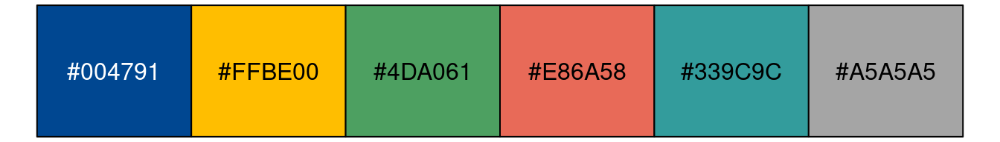
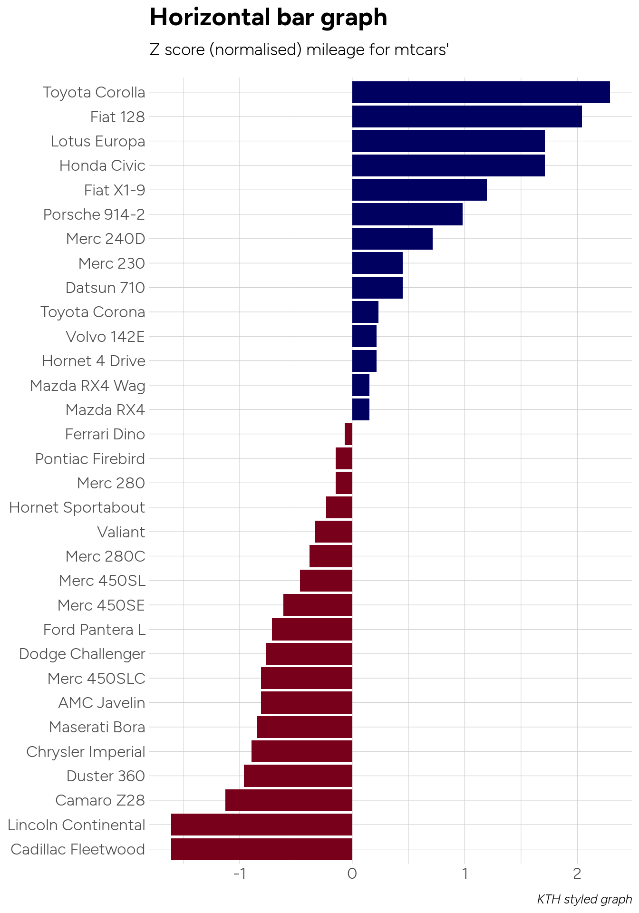
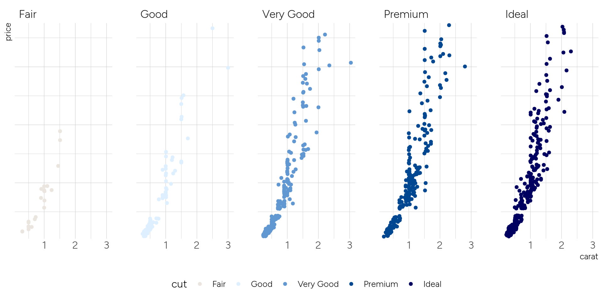

<!-- README.md is generated from README.Rmd. Please edit that file -->

# ktheme

<!-- badges: start -->

<!-- badges: end -->

This is an R package providing some styling resources for web content
intended to align with the graphical profile used at KTH - the Royal
Institue of Technology.

It is heavily inspired by <https://github.com/hrbrmstr/hrbrthemes>. Most
of the graphical design considerations, the package structure used and
the functions are either ripped directly or modified slightly from that
package adapting it to [KTH’s graphical
profile](https://intra.kth.se/en/administration/kommunikation/grafiskprofil)

The styling assets and resources are different, though (fonts,
templates, color palettes etc).

## Content

This package installs various styling assets as outlined below.

### Fonts

It includes fonts in the two main font families used in the graphical
profile of KTH:

  - Open Sans (primary font; to be used for web content and for text
    inside plots)
  - Georgia (KTH has a license to use this MS font)
  - Open Sans Condensed is a narrow variant of Open Sans (looks even
    better in plots)

### Templates for rmarkdown content

Two templates are provided for styling `rmarkdown` authored content:

  - one for general HTML content with the KTH CSS styles
  - one for PDF output

The HTML template uses a stylesheet (CSS file) harvested from
<https://www.kth.se> on 2020-01-08 from
<https://www.kth.se/css/kth-1e5baeb8f6b53eb2cc1503b719827966.css> which
has been “cleaned” or “beautified” with
<https://www.cleancss.com/css-beautify/>.

This stylesheet is fairly long and refers to some online images and
assets using relative paths, which has been modified (into using HTTP
scheme-agnostic urls with absolute paths like
`//www.kth.se/img/kth-style/icons/alert-info-d5989d78df9dec269a3bfa93b36e18e3.svg`.

This makes it possible to use the CSS when rendering rmarkdown content
into standalone HTML, but currently the rendering step requires some
patience due to the lag when the online assets are pulled in from the
web.

### Theme for ggplot2

It also provides a `theme_kth()` function which can be used to style
ggplots.

### Color palette

Finally, there is a set of color palettes based on the five [KTH
signature
colors](https://intra.kth.se/en/administration/kommunikation/grafiskprofil/profilfarger-1.845077).

This color palette can be used to color qualitative data, sequential
data and diverging data.

  - qualitative palette for nominal or unordered categorical values
    (using the primary KTH profile color (blue), followed by the four
    secondary profile colors, each in three variants using 100%, 40% and
    80% alpha respectively, thus providing a total of 5 x 3 = 15 colors)
  - sequential palette for quantitative magnitudes - high/low values -
    or for ordered categorical data (the primary color in 5 stepped
    variations - using varying levels of alpha)
  - diverging palette for use with quantitative values centered around
    some point - or centered ordered categorical data (the primary color
    is used on one end of the palette and the closest complement color
    on the other to provide a 7-color palette with three steps of blue,
    a gray midpoint and three steps of red)

## Installation

You can install the development version of `ktheme` from
[GitHub](https://github.com/) with:

``` r
# install.packages("devtools")
devtools::install_github("KTH-Library/ktheme")
```

## Usage

A helper function is availble for system-wide install of fonts on Linux
OSes:

``` r
# install from https://github.com/KTH-Library/bibliomatrix
library(ktheme)
install_fonts_linux()

library(extrafont)
extrafont::loadfonts()

# required in the following usage examples 
library(dplyr)
library(ggplot2)
library(Cairo)
```

Here are usage examples showing plots made using the different KTH color
palettes and the Open Sans font.

A plain vanilla scatter plot:

``` r
ggplot(mtcars, aes(mpg, wt)) +
  geom_point() +
  labs(x="Fuel efficiency (mpg)", y="Weight (tons)",
    title="KTH styled ggplot2 scatterplot example",
    subtitle="A plot that is only useful for demonstration purposes",
    caption="Caption goes here!") + 
  theme_kth()
```

<!-- -->

Using the KTH palette, qualitative coloring:

``` r

ggplot(iris, aes(Species, Sepal.Length)) + 
  geom_boxplot(aes(fill = Species)) +
  scale_fill_kth() +
  theme_kth() +
  theme(legend.position = "top")
```

<!-- -->

``` r

ggplot(iris, aes(Sepal.Length, Sepal.Width)) + 
  geom_point(aes(color = Species)) +
  scale_color_kth() +
  theme_kth()+
  theme(legend.position = "top")
```

<!-- -->

Another example using demo data:

``` r
ggplot(mpg, aes(displ, hwy)) +
  geom_jitter(aes(color=class, fill=class), size=3, shape=21, alpha=1/2) +
  scale_x_continuous(expand=c(0,0), limits=c(1, 8), breaks=1:8) +
  scale_y_continuous(expand=c(0,0), limits=c(10, 50)) +
  scale_color_kth() +
  scale_fill_kth() +
  facet_wrap(~class, scales="free") +
  labs(
    title="KTH styled plots",
    subtitle="These plots show some example data",
    caption="Source: ktheme R package"
  ) +
  theme_kth(grid="XY", axis="xy") +
  theme(legend.position="none") -> gg

flush_ticks(gg)
#> theme(axis.text.x=element_text(hjust=c(0, rep(0.5, 6), 1))) +
#> theme(axis.text.y=element_text(vjust=c(0, rep(0.5, 3), 1)))
```

<!-- -->

Diverging colors:

``` r
cars <- 
  mtcars %>%
  mutate(brand = rownames(mtcars)) %>%
  mutate(mpg_z_score = (mpg - mean(mpg, na.rm = TRUE)) / sd(mpg)) %>%
  mutate(mpg_type = ifelse(mpg_z_score < 0, "below", "above")) %>%
  mutate(CarBrand = factor(mpg_type, levels = unique(mpg_type)))

pdiv <- palette_kth(n = 7, type = "div")[c(1, 7)]
names(pdiv) <- NULL

ggplot(cars, aes(x=reorder(brand, mpg_z_score), y=mpg_z_score, label=mpg_z_score)) +
  geom_bar(stat='identity', aes(fill=mpg_type)) +
  scale_fill_manual(name="Mileage (deviation)",
    labels = c("Above Average", "Below Average"),
    values = c("above" = pdiv[1], "below" = pdiv[2])) +
  labs(subtitle="Z score (normalised) mileage for mtcars'",
    title= "Horizontal bar graph", caption="KTH styled graph") +
  theme_kth() +
  theme(
    axis.title.y=element_blank(),
    axis.title.x=element_blank(),
    legend.position="none"
  ) +
  coord_flip()
```

<!-- --> Sequential
discrete colors versus qualitative discrete colors:

``` r
library(patchwork)

pdiv <- rev(tolower(palette_kth(n = 5, type = "seq") %>% setNames(NULL)))
dsamp <- diamonds[1 + 1:1000 * 50, ]

gg <- ggplot(dsamp, aes(carat, price, color = cut)) + geom_point()

gg1 <- gg + scale_color_manual(values = pdiv) + theme_kth() + scale_y_comma()

gg2 <- gg + scale_color_kth() + theme_kth() + scale_y_comma()

gg3 <- gg + facet_wrap(~cut, ncol = 5) + scale_color_manual(values = pdiv) + theme_kth() + scale_y_comma() + theme(legend.position="bottom")

gg1 + gg2
```

<!-- -->

In this case it might be better to use small multiples (like below) or
another type of visual.

``` r
gg3
```

<!-- -->

A narrow or condensed variant of Open Sans is available.

``` r
#update_geom_font_defaults(family=font_osc)
#import_open_sans_condensed()
#extrafont::loadfonts()

# library(readr)
# ft <- read_csv(system.file("fontmap", "fonttable.csv", package="extrafontdb"))
# regular_osc <- ft %>% filter(FamilyName == "Open Sans Condensed") %>% head(1)
# regular_osc$FullName <- "Open Sans Condensed"
# regular_osc$Bold <- FALSE
# ft_new <- bind_rows(ft, regular_osc)
# write_csv(ft_new, path = system.file("fontmap", "fonttable.csv", package="extrafontdb"))

library(dplyr)
library(ggplot2)

count(mpg, class) %>%
ggplot(aes(class, n)) +
geom_col(aes(fill = class)) +
geom_text(aes(label=paste0("n=", n)), nudge_y=3) +
labs(x="Vehicle category", y="Observations (n)",
     title="Seminal ggplot2 bar chart example",
     subtitle="A plot that is only useful for demonstration purposes",
     caption="A demo of theme_kth_osc") +
theme_kth_osc() +
scale_fill_kth() +
theme(axis.text.y=element_blank())
```

<!-- -->

Examples of customized ggplots used in the R package `bibliomatrix`:

``` r

library(dplyr)
library(patchwork)
suppressPackageStartupMessages(library(bibliomatrix))  

# using bibliomatrix::abm_table fcn to get some data
con <- con_bib("sqlite")
cf <- abm_table3(con, unit_code = "KTH", analysis_start = 2013, analysis_stop = 2018) %>% filter(interval == "Total") %>% pull(cf)
DBI::dbDisconnect(con)

# this is a ggplot2-based bullet graph
p1 <- abm_bullet(label = "Field normalized citations (Cf)", 
  value = cf, reference = 1.0, roundto = 2) + 
    theme_kth() + 
    # override some theme settings
    theme(
      plot.title=element_text(size = 12),
      axis.text.x=element_text(size = 8),
      axis.title.x=element_blank(),
      axis.title.y=element_blank(),
      axis.line.y=element_blank(),
      axis.line.x=element_blank(),
      axis.text.y=element_blank(),
      axis.ticks.x=element_blank(),
      panel.grid.major=element_blank(),
      panel.grid.minor=element_blank()
    )

con <- con_bib()

nonuniv_share <- 
  abm_table5(con, unit_code = "KTH") %>% filter(interval == "Total") %>% pull(nonuniv_share)

DBI::dbDisconnect(con)

nonuniv_lbl <- 
  sprintf("Swedish non-university: %d%%", round(100 * nonuniv_share))

# this is a ggplot2-based waffle chart
p2 <- abm_waffle_pct(nonuniv_share, label = nonuniv_lbl) +
  theme_kth() + 
  # override some theme settings
  theme(
    axis.text.y=element_blank(),
    axis.text.x=element_blank(),
    legend.position="none",
  )

p1 + p2
```

<!-- -->
